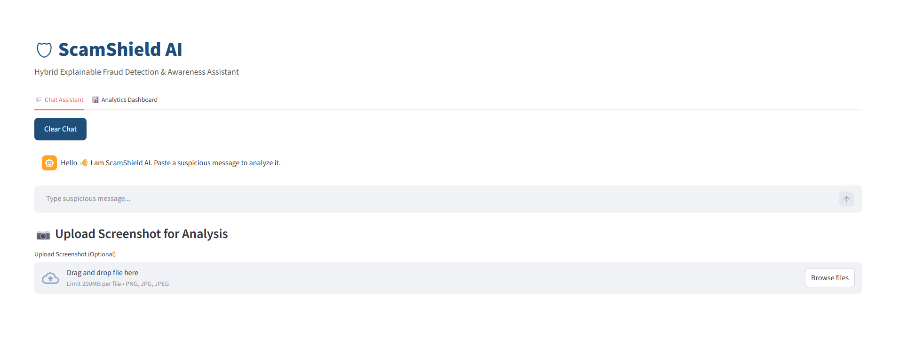
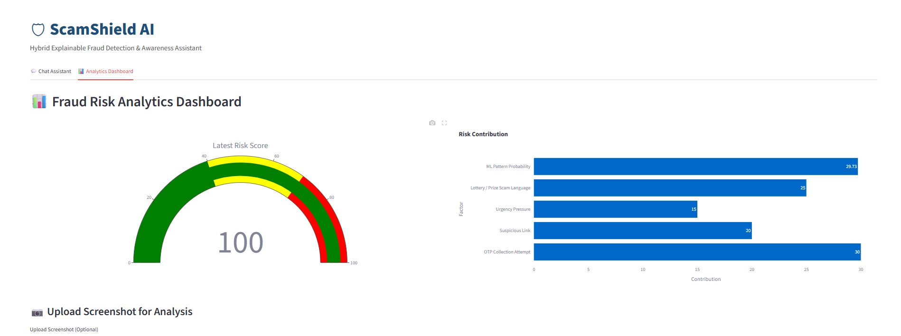
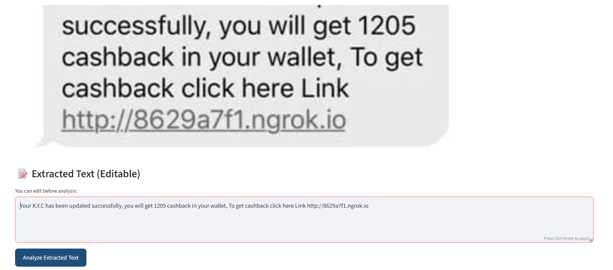

# 🛡️ ScamShield AI

## 📌 Overview

ScamShield AI is an intelligent fraud detection and awareness application developed using **Python** and **Streamlit**. It helps users identify suspicious messages and potential scams using a combination of **Machine Learning**, **Optical Character Recognition (OCR)**, and a **rule-based risk analysis engine**.

The application not only detects scams but also explains why a message is considered suspicious by highlighting risk indicators and providing awareness tips to educate users.


## ✨ Features

- 🔍 Analyze suspicious text messages
- 🤖 Machine Learning-based scam detection
- 📷 OCR support for analyzing screenshots
- ⚠️ Rule-based fraud risk scoring
- 🧠 Explainable AI with detailed reasoning
- 🏷️ Scam category classification
- 📊 Interactive analytics dashboard
- 💬 Chat-style user interface
- 📚 Scam awareness and safety recommendations

---

## 🛠️ Technologies Used

- Python
- Streamlit
- Pandas
- Scikit-learn
- TF-IDF Vectorizer
- Multinomial Naive Bayes
- Plotly
- Pillow (PIL)
- Tesseract OCR
- Regular Expressions (Regex)

---

## 📂 Dataset

This project uses the **SMS Spam Collection Dataset**, where:

- **Spam** messages are treated as **Fraud**
- **Ham** messages are treated as **Legitimate**

The dataset is used to train a Naive Bayes classifier for scam detection.

---

## ⚙️ How It Works

1. User enters a suspicious message or uploads a screenshot.
2. OCR extracts text from uploaded images.
3. The text is analyzed using:
   - Machine Learning (TF-IDF + Naive Bayes)
   - Rule-based fraud detection
4. A fraud risk score is calculated.
5. Scam indicators are highlighted.
6. The system explains the reasoning behind its decision.
7. The analytics dashboard visualizes the detected risk factors.

---

## 🚀 Installation

Clone the repository:

```bash
git clone https://github.com/your-username/ScamShield-AI.git
```

Move into the project directory:

```bash
cd ScamShield-AI
```

Install the required packages:

```bash
pip install -r requirements.txt
```

Install **Tesseract OCR** on your system.

For Windows:

1. Download Tesseract OCR.
2. Install it.
3. Update the path inside `app.py` if required:

```python
pytesseract.pytesseract.tesseract_cmd = r"C:\Program Files\Tesseract-OCR\tesseract.exe"
```

---

## ▶️ Run the Application

```bash
streamlit run app.py
```


## 📈 Project Structure

```
ScamShield-AI/
│
├── app.py
├── spam.csv
├── requirements.txt
├── README.md
├── .gitignore
└── screenshots/
```
## 📸 Screenshots

### 🏠 Home Page



---

### 💬 Scam Analysis


---

### 📊 Analytics Dashboard


---
---

### 📷 OCR Analysis



## 🔮 Future Enhancements

- Deep Learning-based fraud detection
- Real-time URL reputation checking
- QR code scam detection
- Voice scam detection
- Email phishing analysis
- Multilingual scam detection
- Cloud deployment
- Mobile application

---

## 👩‍💻 Author

** C Harshitha **

Computer Science Engineering Student

---

## 📄 License

This project is developed for educational and learning purposes.
